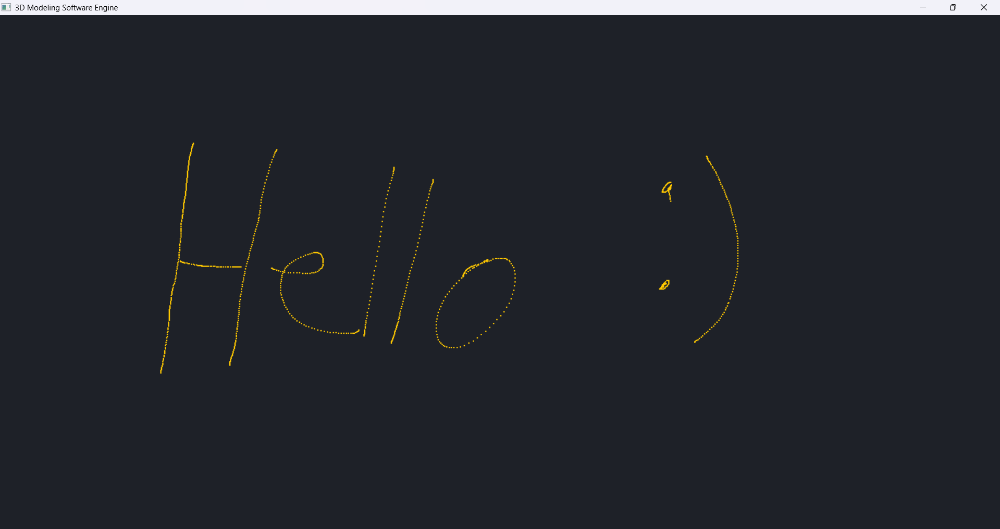

# 3D Modeling Software

**A Real-Time 3D Modeling Engine**  
*Built for CSE382 Computer Graphics – Spring 2025/2026*

---

## Overview

A modern, high-performance 3D modeling application focused on implementing core computer graphics concepts from scratch — including curves, surfaces, mesh data structures, and subdivision algorithms.

The engine is built with a clean architecture separating the **software rasterizer**, **hardware presentation layer (DirectX 11)**, and **platform layer**, providing a solid foundation for real-time interactive 3D modeling.



---

## Current Features

### Core Engine
- **Software Renderer**: Fast CPU-based rasterizer with dynamic canvas management
- **DirectX 11 Backend**: High-performance hardware presentation with proper resource management
- **Live Window Resizing**: Smooth resize handling during drag and release
- **Input System**: Robust keyboard and mouse input handling
- **Clean Architecture**: Modular design with separated concerns

### Interactive Drawing
- Real-time pixel drawing with **2x2 gold brush** (Left Mouse Button)
- Clear canvas with **Space**
- Dark editor theme (`#1E2128`)
- Escape to quit

---

## Tech Stack

| Layer              | Technology                          |
|--------------------|-------------------------------------|
| Language           | C++23                               |
| Build System       | CMake + Ninja                       |
| Platform           | Win32 API                           |
| Rendering          | Custom Software Renderer + DirectX 11 |
| IDE Support        | Visual Studio 2022+                 |

---

## Project Structure

```bash
.
├── CMakeLists.txt
├── CMakePresets.json
├── src/
│   ├── Application/
│   │   ├── Application.cpp
│   │   └── Application.h
│   ├── Platform/
│   │   ├── Win32Window.cpp
│   │   ├── Win32Window.h
│   │   ├── Win32API.h
│   │   └── Input.h
│   ├── Renderer/
│   │   ├── SoftwareRenderer.cpp
│   │   ├── SoftwareRenderer.h
│   │   ├── DX11Renderer.cpp
│   │   └── DX11Renderer.h
│   └── Main.cpp
├── docs/
│   └── imgs/
│       └── 2026-5-21.png
├── external/
│   └── imgui/          # (planned for UI)
├── Doxyfile
├── LICENSE
└── README.md
```

---

## Building the Project

### Prerequisites
- Windows 10/11
- Visual Studio 2022 or later (with C++ Desktop Development)
- CMake 3.25+

### Using CMake Presets (Recommended)

```bash
# Configure (Debug)
cmake --preset x64-debug

# Build
cmake --build --preset x64-debug

# Run
./out/build/x64-debug/3DModelingSoftware.exe
```

### Other Presets Available
- `x64-release`
- `x86-debug` / `x86-release`

---

## Controls

| Input              | Action                        |
|--------------------|-------------------------------|
| **Left Mouse**     | Draw with 2x2 gold brush      |
| **Space**          | Clear canvas                  |
| **Escape**         | Exit application              |
| **Resize Window**  | Live canvas & renderer resize |

---

## Roadmap (Course Objectives)

- [ ] Bézier Curves & B-Splines (De Boor Algorithm)
- [ ] NURBS Surface Implementation
- [ ] Bézier Surface Generation
- [ ] Half-Edge Mesh Data Structure
- [ ] Polygon Triangulation
- [ ] Catmull-Clark & Loop Subdivision
- [ ] Real-time Control Point Editing
- [ ] ImGui Integration (Editor UI)
- [ ] Camera System & 3D Navigation
- [ ] Mesh Import/Export

---

## Documentation

Generate Doxygen documentation:

```bash
doxygen Doxyfile
```

Output will be available in `docs/doxygen/`.

---

## License

This project is licensed under the **MIT License** - see the [LICENSE](LICENSE) for details.

---

## Authors

- **Ahmed Yasser**
- **Saif Amer**
